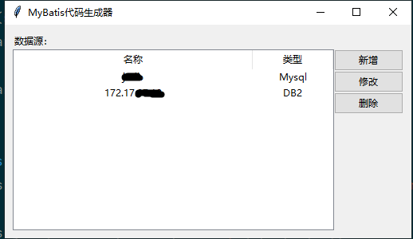
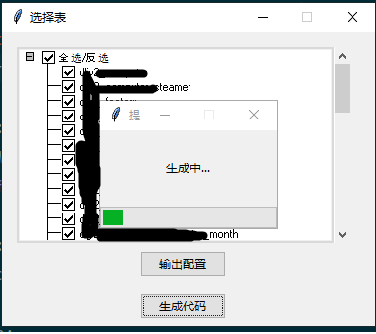

# py_mybatis_generator_gui
基于python tinker开发的图形化Mybatis代码生成工具
代码生成直接调用mybatis-generator-core-1.4.0.jar

## 开发环境
* Python 3+

## 运行环境
* Python 3+
* JRE

## 项目结构

* MybatisGeneratorGUI 界面和调用jar代码
* Db2Info Java实现的DB2数据表信息访问工具，为了避免安装ibm_db2

## 运行方法
1. 将MybatisGeneratorGUI导入Pycharm
2. 创建venv，安装pymysql
3. 运行

## 文档

[使用说明](https://github.com/oHeHeHou/py_mybatis_generator_gui/blob/main/docs/%E4%BD%BF%E7%94%A8%E8%AF%B4%E6%98%8E.md)

[数据库设计](https://github.com/oHeHeHou/py_mybatis_generator_gui/blob/main/docs/%E6%95%B0%E6%8D%AE%E5%BA%93%E8%AE%BE%E8%AE%A1.md)
