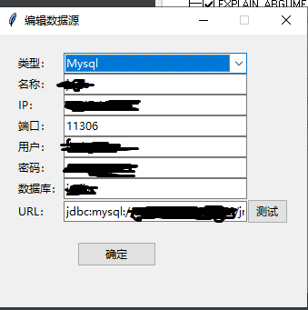
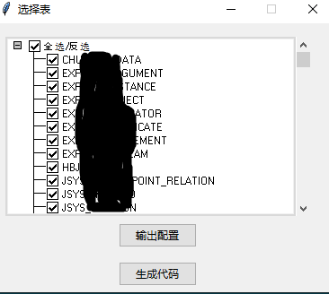
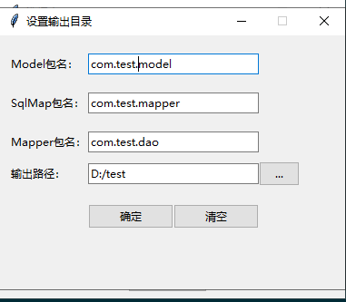
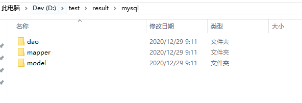

1. 在主页上，点击"新增"，增加数据源

    

2. 输入IP，端口等信息，点击”测试“可以测试连通性，点击”确定“保存

    
    
3. 在列表页面双击数据源项，进入表名列表

     
     
4. 点击”输出配置“，可以设置代码报名和输出目录，点击"确定"保存

    
    
5. 点击”生成代码“，会进行代码生成

    
    
6. 生成完毕后，会自动打开代码输出目录

    
